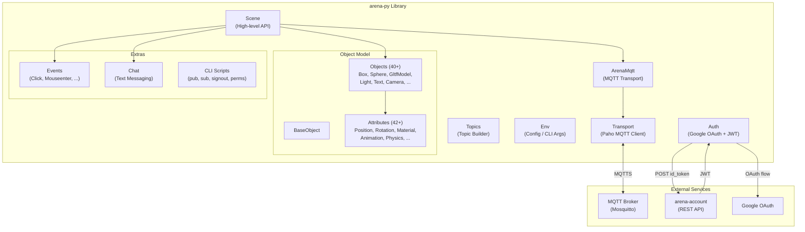
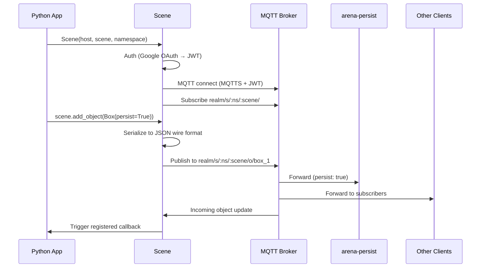

# ARENA Python (arena-py) — Requirements & Architecture

> **Purpose**: Machine- and human-readable reference for the ARENA Python client library's features, architecture, and source layout.

## Architecture

## Source File Index

| File / Directory | Role | Key Symbols |
|------------------|------|-------------|
| [arena/scene.py](arena/scene.py) | Scene class: connection, object CRUD, task scheduling | `Scene`, `add_object`, `update_object`, `delete_object`, `get_persisted_obj`, `run_once`, `run_after_interval`, `run_forever`, `run_async`, `run_tasks` |
| [arena/arena_mqtt.py](arena/arena_mqtt.py) | MQTT connection and message handling | `ArenaMqtt`, `on_connect`, `on_message`, `publish` |
| [arena/auth.py](arena/auth.py) | Google OAuth and JWT token management | `authenticate`, `get_token`, browser and device code flows |
| [arena/transport.py](arena/transport.py) | Paho MQTT transport layer | `Transport`, `connect`, `disconnect`, TLS configuration |
| [arena/topics.py](arena/topics.py) | MQTT topic construction | topic format strings for scenes, objects, users |
| [arena/env.py](arena/env.py) | Environment config and CLI arg parsing | `MQTTH`, `REALM`, `SCENE`, `NAMESPACE` |
| [arena/base_object.py](arena/base_object.py) | Base class for all ARENA objects | `BaseObject` |
| [arena/device.py](arena/device.py) | Device abstraction | `Device` |
| [arena/objects/](arena/objects/) | 40+ object type classes (schema-generated) | `Box`, `Sphere`, `GltfModel`, `Light`, `Text`, `Camera`, `Cylinder`, `Cone`, `Line`, `Image`, etc. |
| [arena/attributes/](arena/attributes/) | 42+ attribute/component classes (schema-generated) | `Position`, `Rotation`, `Scale`, `Material`, `Animation`, `AnimationMixer`, `Color`, `Shadow`, `Sound`, `PhysxBody`, etc. |
| [arena/events/](arena/events/) | Event type definitions | `Event`, click, mouseenter, mouseleave, collision |
| [arena/chat/](arena/chat/) | Chat messaging | `Chat` |
| [arena/scripts/](arena/scripts/) | CLI entry points | `arena-py-pub`, `arena-py-sub`, `arena-py-signout`, `arena-py-permissions` |
| [arena/utils/](arena/utils/) | Utility modules | helpers, constants |
| [arena/event_loop/](arena/event_loop/) | Async event loop management | task scheduling internals |
| [examples/](examples/) | Example programs (~211 files) | object creation, attributes, legacy demos |
| [tools/](tools/) | Reusable scene tools (~73 files) | digital twins, utilities |
| [setup.py](setup.py) | Package configuration | pip install `arena-py` |

## Feature Requirements

### Scene & Connection

| ID | Requirement | Source |
|----|-------------|--------|
| REQ-PY-001 | Scene connection with host, namespace, scene parameters | [arena/scene.py#Scene](arena/scene.py) |
| REQ-PY-002 | Google OAuth browser-based authentication (desktop) | [arena/auth.py](arena/auth.py) |
| REQ-PY-003 | Google OAuth device code flow (headless/server) | [arena/auth.py](arena/auth.py) |
| REQ-PY-004 | Automatic JWT acquisition and renewal via arena-account | [arena/auth.py](arena/auth.py) |
| REQ-PY-005 | TLS/SSL MQTT connection | [arena/transport.py](arena/transport.py) |

### Object CRUD

| ID | Requirement | Source |
|----|-------------|--------|
| REQ-PY-010 | `add_object` — create and publish ARENA object | [arena/scene.py#add_object](arena/scene.py) |
| REQ-PY-011 | `update_object` — update and publish object attributes | [arena/scene.py#update_object](arena/scene.py) |
| REQ-PY-012 | `delete_object` — delete object from scene | [arena/scene.py#delete_object](arena/scene.py) |
| REQ-PY-013 | `get_persisted_obj` — fetch object from persistence | [arena/scene.py#get_persisted_obj](arena/scene.py) |
| REQ-PY-014 | Persistence support (`persist=True` flag on objects) | [arena/scene.py](arena/scene.py) |

### Object Types & Attributes

| ID | Requirement | Source |
|----|-------------|--------|
| REQ-PY-020 | 40+ object types (Box, Sphere, GltfModel, Light, Text, Camera, etc.) | [arena/objects/](arena/objects/) |
| REQ-PY-021 | 42+ attribute/component types (Position, Rotation, Material, Animation, Physics, etc.) | [arena/attributes/](arena/attributes/) |
| REQ-PY-022 | Schema-generated classes from arena-schemas | [arena/objects/](arena/objects/), [arena/attributes/](arena/attributes/) |
| REQ-PY-023 | JSON serialization matching ARENA wire format | [arena/base_object.py](arena/base_object.py) |

### Events & Interaction

| ID | Requirement | Source |
|----|-------------|--------|
| REQ-PY-030 | Event handling (click, mouseenter, mouseleave, collision) | [arena/events/](arena/events/) |
| REQ-PY-031 | Event callbacks on objects | [arena/scene.py](arena/scene.py) |
| REQ-PY-032 | Chat messaging (send/receive text) | [arena/chat/](arena/chat/) |

### Task Scheduling

| ID | Requirement | Source |
|----|-------------|--------|
| REQ-PY-040 | `run_once` — execute task once at start | [arena/scene.py#run_once](arena/scene.py) |
| REQ-PY-041 | `run_after_interval` — execute after delay | [arena/scene.py#run_after_interval](arena/scene.py) |
| REQ-PY-042 | `run_forever` — execute task in a loop | [arena/scene.py#run_forever](arena/scene.py) |
| REQ-PY-043 | `run_async` — execute async task | [arena/scene.py#run_async](arena/scene.py) |
| REQ-PY-044 | `run_tasks` — start event loop | [arena/scene.py#run_tasks](arena/scene.py) |

### CLI Tools

| ID | Requirement | Source |
|----|-------------|--------|
| REQ-PY-050 | `arena-py-pub` — publish scene object messages from CLI | [arena/scripts/](arena/scripts/) |
| REQ-PY-051 | `arena-py-sub` — subscribe to scene or custom topic from CLI | [arena/scripts/](arena/scripts/) |
| REQ-PY-052 | `arena-py-signout` — clear cached authentication | [arena/scripts/](arena/scripts/) |
| REQ-PY-053 | `arena-py-permissions` — display current JWT permissions | [arena/scripts/](arena/scripts/) |

## Supported Entities

> See also: [arena-web-core](https://github.com/arenaxr/arena-web-core/blob/master/REQUIREMENTS.md#supported-entities) · [arena-unity](https://github.com/arenaxr/arena-unity/blob/main/REQUIREMENTS.md#supported-entities)

| Entity                 | Python Status | Description                                                |
| ---------------------- | -------------- | ---------------------------------------------------------- |
| `arenaui-button-panel` | ✅ 0.6.0       | Flat UI displays a vertical or horizontal panel of buttons |
| `arenaui-card`         | ✅ 0.6.0       | Flat UI displays text and optionally an image              |
| `arenaui-prompt`       | ✅ 0.6.0       | Flat UI displays prompt with button actions                |
| `box`                  | ✅ 0.1.12      | Box geometry                                               |
| `capsule`              | ✅ 0.9.0       | Capsule geometry                                           |
| `circle`               | ✅ 0.1.12      | Circle geometry                                            |
| `cone`                 | ✅ 0.1.12      | Cone geometry                                              |
| `cylinder`             | ✅ 0.1.12      | Cylinder geometry                                          |
| `dodecahedron`         | ✅ 0.1.12      | Dodecahedron geometry                                      |
| `entity`               | ✅ 0.1.12      | Entities are the base of all objects in the scene          |
| `env-presets`          | -              | A-Frame Environment and presets                            |
| `gaussian_splatting`   | ✅ 0.9.0       | Load a Gaussian Splat model                                |
| `gltf-model`           | ✅ 0.1.12      | Load a GLTF model                                          |
| `icosahedron`          | ✅ 0.1.12      | Icosahedron geometry                                       |
| `image`                | ✅ 0.1.12      | Display an image on a plane                                |
| `light`                | ✅ 0.1.12      | A light                                                    |
| `line`                 | ✅ 0.1.12      | Draw a line                                                |
| `obj-model`            | ✅ 0.10.1      | Load an OBJ model                                         |
| `ocean`                | ✅ 0.9.0       | Oceans, water                                              |
| `octahedron`           | ✅ 0.1.12      | Octahedron geometry                                        |
| `pcd-model`            | ✅ 0.9.0       | Load a PCD model                                           |
| `plane`                | ✅ 0.1.12      | Plane geometry                                             |
| `post-processing`      | -              | Visual effects enabled in desktop and XR views             |
| `program`              | ✅ 0.9.0       | ARENA program data                                         |
| `renderer-settings`    | -              | THREE.js WebGLRenderer properties                          |
| `ring`                 | ✅ 0.1.12      | Ring geometry                                              |
| `roundedbox`           | ✅ 0.9.0       | Rounded Box geometry                                       |
| `scene-options`        | -              | ARENA Scene Options                                        |
| `sphere`               | ✅ 0.1.12      | Sphere geometry                                            |
| `tetrahedron`          | ✅ 0.1.12      | Tetrahedron geometry                                       |
| `text`                 | ✅ 0.1.12      | Display text                                               |
| `thickline`            | ✅ 0.1.12      | Draw a line that can have a custom width                   |
| `threejs-scene`        | ✅ 0.9.0       | Load a THREE.js Scene                                      |
| `torus`                | ✅ 0.1.12      | Torus geometry                                             |
| `torusKnot`            | ✅ 0.1.12      | Torus Knot geometry                                        |
| `triangle`             | ✅ 0.1.12      | Triangle geometry                                          |
| `urdf-model`           | ✅ 0.10.0      | Load a URDF model                                          |
| `videosphere`          | ✅ 0.9.0       | Videosphere 360 video                                      |

## Supported Components

> See also: [arena-web-core](https://github.com/arenaxr/arena-web-core/blob/master/REQUIREMENTS.md#supported-components) · [arena-unity](https://github.com/arenaxr/arena-unity/blob/main/REQUIREMENTS.md#supported-components)

| Component                | Python Status | Description                                                                    |
| ------------------------ | -------------- | ------------------------------------------------------------------------------ |
| `animation`              | ✅ 0.1.12      | Animate and tween values                                                       |
| `animation-mixer`        | ✅ 0.1.12      | Play animations in model files                                                 |
| `arena-camera`           | ❌              | Tracking camera movement, emits pose updates                                   |
| `arena-hand`             | ❌              | Tracking VR controller movement, emits pose updates                            |
| `arena-user`             | ✅ 0.8.0       | Another user's camera, renders Jitsi/displayName updates                       |
| `armarker`               | ✅ 0.9.0       | Location marker for scene anchoring in the real world                          |
| `attribution`            | ✅ 0.9.0       | Saves attribution data in any entity                                           |
| `blip`                   | ✅ 0.9.0       | Objects animate in/out of the scene                                            |
| `box-collision-listener` | ✅ 0.9.0       | AABB collision detection for entities with a mesh                              |
| `buffer`                 | ✅ 0.1.12      | Transform geometry into a BufferGeometry                                       |
| `click-listener`         | ✅ 0.1.12      | Track mouse events and publish corresponding events                            |
| `collision-listener`     | ✅ 0.9.0       | Listen for collisions, callback on event                                       |
| `geometry`               | ✅ 0.1.12      | Primitive mesh geometry support                                                |
| `gesture-detector`       | ❌              | Detect multi-finger touch gestures                                             |
| `gltf-model-lod`         | ✅ 0.9.0       | GLTF LOD switching based on distance                                           |
| `gltf-morph`             | ✅ 0.1.12      | GLTF 3D morphable model controls                                              |
| `goto-landmark`          | ✅ 0.1.12      | Teleports user to landmark                                                     |
| `goto-url`               | ✅ 0.1.12      | Navigate to given URL                                                          |
| `hide-on-enter-ar`       | ✅ 0.1.12      | Hide object when entering AR                                                   |
| `hide-on-enter-vr`       | ✅ 0.1.12      | Hide object when entering VR                                                   |
| `jitsi-video`            | ✅ 0.1.39      | Apply Jitsi video source to geometry                                           |
| `landmark`               | ✅ 0.1.13      | Define entities as landmarks for navigation                                    |
| `look-at`                | ✅ 0.1.13      | Dynamically rotate to face another entity or position                          |
| `material`               | ✅ 0.1.12      | Material properties of the object's surface                                    |
| `material-extras`        | ✅ 0.9.0       | Extra material properties: encoding, render order                              |
| `model-container`        | ✅ 1.3.0       | Override absolute size for a 3D model                                          |
| `modelUpdate`            | ✅ 0.9.0       | Manually manipulate GLTF child components                                      |
| `multisrc`               | ✅ 0.9.0       | Define multiple visual sources for an object                                   |
| `parent`                 | ✅ 0.1.12      | Parent's object_id; child inherits scale and translation                       |
| `physx-body`             | ✅ 1.4.0       | PhysX rigid body (replaces deprecated dynamic-body, static-body)               |
| `physx-force-pushable`   | ✅ 1.4.0       | Makes physx-body pushable by user (replaces deprecated impulse)                |
| `physx-grabbable`        | ✅ 1.4.0       | Allows user hands to grab/pickup physx-body objects                            |
| `physx-joint`            | ✅ 1.4.0       | PhysX joint between rigid bodies                                               |
| `physx-joint-constraint` | ✅ 1.4.0       | Adds constraint to a physx-joint                                               |
| `physx-joint-driver`     | ✅ 1.4.0       | Creates driver to return joint to initial position                             |
| `physx-material`         | ✅ 1.4.0       | Controls physics properties for shapes or bodies                               |
| `position`               | ✅ 0.1.12      | 3D object position                                                             |
| `remote-render`          | ❌              | Whether or not an object should be remote rendered                             |
| `rotation`               | ✅ 0.1.12      | 3D object rotation in quaternion (right-hand coordinate system)                |
| `scale`                  | ✅ 0.1.12      | 3D object scale                                                                |
| `screenshareable`        | ✅ 0.1.12      | Allows an object to be screenshared upon                                       |
| `shadow`                 | ✅ 0.9.0       | Whether the entity casts/receives shadows                                      |
| `show-on-enter-ar`       | ✅ 0.1.12      | Show object when entering AR                                                   |
| `show-on-enter-vr`       | ✅ 0.1.12      | Show object when entering VR                                                   |
| `skipCache`              | ✅ 0.1.12      | Disable retrieving shared geometry from cache                                  |
| `sound`                  | ✅ 0.1.12      | Defines entity as a source of sound or audio                                   |
| `spe-particles`          | ✅ 0.7.0       | GPU based particle systems                                                     |
| `submodel-parent`        | ✅ 1.0.1       | Attach to submodel components of model                                         |
| `textinput`              | ✅ 0.1.24      | Opens HTML prompt when clicked, sends text input as MQTT event                 |
| `video-control`          | ✅ 0.3.0       | Adds video to entity and controls playback                                     |
| `visible`                | ✅ 0.1.12      | Whether or not an object should be rendered visible                            |

## Message Flow

## Planned / Future

- Type-safe attribute builders
- Async/await first-class support
- Enhanced batch operations
