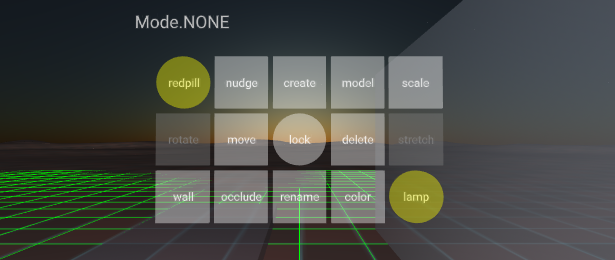

# ARENA AR Builder
An AR/VR capable editing tool to create/manipulate/delete ARENA objects. See top-level python documentation for [requirements](../README.md). This tool uses the [ARENA Persistence Database](https://github.com/conix-center/arena-persist), so all changes are persisted.

## Quick Start
Usage: `arb` takes at minimum one argument, the first one, a scene name (`hello` in this example).
```
python arb.py hello
```
(interact with the tool at https://xr.andrew.cmu.edu?scene=hello) 

## Control Panel


- **VR Mode**: Click and hold your mouse to move your camera relative to the panel. 
- **AR Mode**: Move your AR device to move your camera relative to the panel.
- **All Modes**: Use the **lock** button to reposition the panel relative to your camera's rotation. *(in development)*

|Button|Type|Description|
|--|--|--|
|**color**|*action*|Allows color select; tap object to color it *(default=#ffffff)*.|
|**create**|*action*|Allows shape select; tap clipboard object to create it in place *(default=sphere)*.|
|**delete**|*action*|Tap object to delete it.|
|**lamp**|*toggle*|Turns a headlamp on/off.|
|**lock**|*toggle*|Off=panel maintains relative world position; On=panel follows camera rotation. *(in development)*|
|**model**|*action*|Allows GLTF model select; tap clipboard object to create it in place *(default=duck.glb)*.|
|**move**|*action*|Tap an object to show it in the clipboard, tap clipboard object to move it to that place.|
|**nudge**|*action*|Tap an object to show yellow nudge-lines; tap a nudge-line to move the object to the nearest 0.1m. A yellow circle will also show x,z position on the floor (y=0).|
|**occlude**|*action*|Allows occlusion on/off select; tap object to occlude it *(default=on)*.|
|**redpill**|*toggle*|Reveals useful debug data: ***gridlines*** on the floor (y=0) can be seen from above and below, ***occlusion mask*** will show all occluded objects, ***object data*** mouse hover on an object will shows its position, rotation, and scale.
|**rename**|*action*|Allows typing a new name; tap an object to apply the new name.|
|**rotate**|*action*|Allows object rotation. *(in development)*|
|**scale**|*action*|Tap an object to show blue scale-lines; tap a scale-line to increase/decrease scale in 3 degrees 0.1m. Minimum 0.1m.
|**stretch**|*action*|Allows altering scale in one of 6Dof. *(in development)*|
|**wall**|*action*|Allows creation of a basic wall 0.1m thick; tap clipboard brick once with your AR device flush with one corner of the wall, and tap the second time at the opposing corner. Three alignment markers will appear for 2 minutes. *(in development)*|

## Clipboard

The clipboard is a temporary see-through object floating in front of the user used to show the relative position of placing a future object. It's also used in AR to have something to fire an event at where no object currently exists. 

## Construction Cone

There is a small temporary object resting on position 0,0,0 in the shape of a construction cone to mark the origin of the scene. It will be removed when `arb` stops running.

## Run Options

### Importing Models
You can import a json-formatted manifest of GLTF models to use on the **model** control panel option *(under development)*. You can write your own, or use the example, `arb-manifest.json`.
```
python arb.py hello -m arb-manifest.json
```

