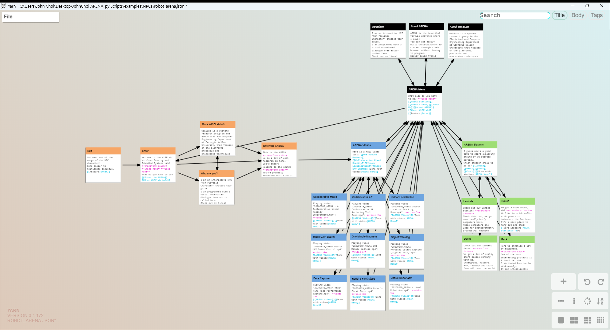
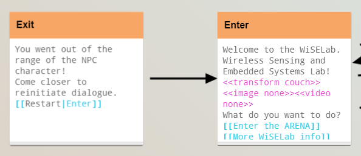
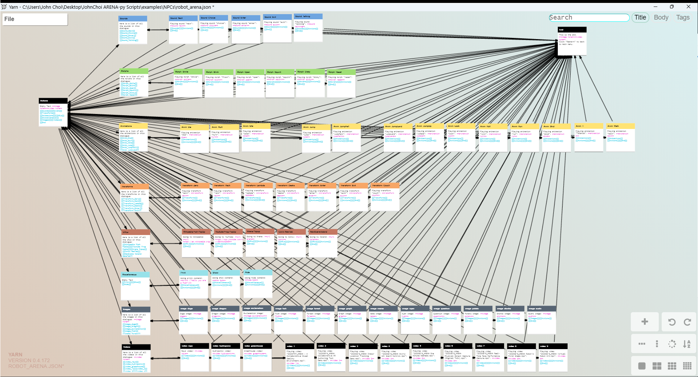

# arena-py NPC Readme
=3.10-blue"/>   

This demo repository contains scripts, tools, and examples for adding animated, interactive NPCs (Non-Player Characters) into ARENA scenes. NPC avatars can be linked to play iterating text speech like in an interactive visual novel, complete with triggers for animations, blendshapes, sound effects, image/videos, point-to-point movement and more.

 
*A quick demo of a human operator interacting with a robot NPC avatar learning about the ARENA platform in mixed reality.*

NPCs utilize conversational dialogue trees parsed from JSON files that can be easily created with *YarnClassic*, a visual node-based editor for crafting dialogue trees. 

- YarnClassic's official repository on Github (MIT license):
https://github.com/blurymind/YarnClassic
- Download the YarnClassic editor for your platform here: (supports Mac/Windows/Linux)
https://github.com/blurymind/YarnClassic/releases
- Alternatively, you can use the web app here to create dialogue files:
https://blurymind.github.io/YarnClassic/

## Setup
Install package using pip ([https://pypi.org/project/arena-py/](https://pypi.org/project/arena-py/)):
```shell
pip3 install arena-py
pip3 install colorama
```

## How to run an NPC
Run the terminal command:

```shell
py NPC.py [FOLDER NAME]

```
Replace [FOLDER NAME] with the name/path of the folder that contains the config, dialogue, and mappings JSON files for the NPC you want to run. Note that this folder MUST have one of each file, named exactly config.json, dialogue.json, and mappings.json.


## NPC "Brain" Config JSON files
 
Each NPC "brain" is stored in a folder with three files, with the following names:
- **config.json**: contains all the configuration options for the NPC, with settings for the scene, start position, names, colors and more.
- **dialogue.json**: contains a dialogue tree file, which all conversational pathways and actions this NPC can take.
- **mappings.json**: contains all the trigger action command mappings for this NPC, which define transforms, animations, videos and more.

## NPC config.json file
The `config.json` file contains all basic settings for the NPC you want to run. Here is a full list of what each configuration option does:

### ARENA
|SETTING|DESCRIPTION|SYNTAX|
|-|-|-|
|HOST|Which ARENA server we want to connect to. Should be "arenaxr.org" for most users.|STRING|
|HOST|Which ARENA server we want to connect to. Should be "arenaxr.org" for most users.|STRING|
|HOST|Which ARENA server we want to connect to. Should be "arenaxr.org" for most users.|STRING|

### NODE
|SETTING|DESCRIPTION|SYNTAX|
|-|-|-|

### NPC
|SETTING|DESCRIPTION|SYNTAX|
|-|-|-|

### USE_DEFAULTS
|SETTING|DESCRIPTION|SYNTAX|
|-|-|-|

### TIMERS
|SETTING|DESCRIPTION|SYNTAX|
|-|-|-|

### UI
|SETTING|DESCRIPTION|SYNTAX|
|-|-|-|

### ROOT
|SETTING|DESCRIPTION|SYNTAX|
|-|-|-|

### GLTF
|SETTING|DESCRIPTION|SYNTAX|
|-|-|-|

### PLANE
|SETTING|DESCRIPTION|SYNTAX|
|-|-|-|

### SPEECH
|SETTING|DESCRIPTION|SYNTAX|
|-|-|-|

### CHOICE
|SETTING|DESCRIPTION|SYNTAX|
|-|-|-|

### LINK
|SETTING|DESCRIPTION|SYNTAX|
|-|-|-|


## NPC mappings.json file
The mappings.json file contains a list of trigger action mappings that the dialogue.json file references.

The majority of these mappings are full path names and more detailed 


### DEFAULTS

#### SOUND
#### ANIMATION
#### MORPH
#### MISCELLANEOUS
VIDEO FRAME OBJECT

### MAPPINGS

#### SOUND_MAPPINGS
#### ANIMATION_MAPPINGS
#### TRANSFORM_MAPPINGS
#### MORPH_MAPPINGS
#### URL_MAPPINGS
#### IMAGE_MAPPINGS
#### VIDEO_MAPPINGS


## NPC dialogue.json file
Here is an example `dialogue.json` file in the ArenaRobot folder, which creates dialogue for a cute robot character that talks about Wiselab and the ARENA, and shows off the basic example capabilities of NPC avatars. 
 
*Note: coloring Node headers is optional, and is only useful for organizing `dialogue.json` in the Yarn editor.*

- **Orange section:** Enter/Exit nodes are clearly labeled. Shows off basic line-by-line conversational speech by talking about itself, ARENA, and the Wiselab.
- **Blue section:** A list of older videos showcasing the capabilities of the ARENA platform. When any node here is selected, it will play a video on a plane next to the robot like a PowerPoint presentation.
- **Green section:** A list of transform destinations towards various points of interest around the ARENA main public demo scene. Each transform contains a position and a rotation for the NPC robot avatar to move and rotate to.
- **Black section:** This is largely a repetition of the Orange section, but allows the NPC to loop its conversation to the other sections.

### NPC Yarn Dialogue Format/Syntax
Here is a closer view of the nodes and color highlights:
 
- **Line:** To create a line of NPC speech, write regular text. New lines represent different blocks of speech text, where NPC characters will sequentially speak every block of speech text, line by line, and the user will have to click "Next" to advance the conversation. 

- **Choice:** Add the end of the speech, add user selection Choices with `[[]]`, with the name of the new Node to jump to if the node choice is selected. If you want the Choice bubble to display different text than the name of the Node, then add `|` in between the `[[]]`, with the desired bubble text on the left and the title of the Node to jump to on the right (For example, `[[Go to this node|Node123]]` will show the user "Go to this node" as the selection option and will jump to the Node with name "Node123" if selected). Node Choices are highlighted in blue in the Yarn editor. If a node is connected to another node with a Choice, it will be shown with a directional arrow in the Yarn editor. Be sure to add all user selection choices within the same line.

- **Command:** Add trigger action commands with `<<>>`, on the same line as the speech where you want the trigger action to be activated. You can add multiple trigger action commands on the same line. See trigger action syntax and usage in the "Triggers and Actions" section below. Note: most trigger actions must have corresponding mappings preset in `mappings.json` to be activated; trigger action commands with missing mappings will be ignored. Node trigger actions are highlights in pink in the Yarn editor.


###Trigger Action Commands
Here is a layout list of all example triggers in same the `dialogue.json` file in the ArenaRobot folder. 

*Note: These nodes shown above are not reachable in the ArenaRobot `dialogue.json` without changing the `NODE ENTER` name in the config.json file in same folder.*


Here is a list of all the possible Trigger Action Commands. Custom trigger action commands can be added by manually editing `ArenaDialogueBubbleGroup.py`, `mappings.py`, and `mapping.json`.

|Trigger Type|Description|Syntax|
|-|-|-|
|Sound|Plays the sound property mapped to [SOUND MAPPING] in `mappings.json`.|`<<sound [SOUND MAPPING]>>`|
|Morph|Plays the blendshape morph property mapped to [MORPH MAPPING] in `mappings.json`.|`<<morph [MORPH MAPPING]>>`|
|Animation|Plays the animation mixer property mapped to [ANIMATION MAPPING] in `mappings.json`.|`<<animation [ANIMATION MAPPING]>>`|
|Transform|Plays the transform property mapped to [TRANSFORM MAPPING] in `mappings.json`. Note that this can contain any combination of position, rotation and scale.|`<<transform [TRANSFORM MAPPING]>>`|
|URL|Displays a clickable web URL link defined in [URL MAPPING] in `mappings.json`.|`<<url [URL MAPPING]>>`|
|Image|Displays an image on floating billboard plane defined in [IMAGE MAPPING] in `mappings.json`.|`<<image [IMAGE MAPPING]>>`|
|Video|Displays a video on floating billboard plane defined in [VIDEO MAPPING] in `mappings.json`.|`<<video [VIDEO MAPPING]>>`|
|Print|Debugging function that logs a console message [TEXT STRING].|`<<print ("[TEXT STRING]")>>`|
|Show|Sets the visibility of an object with the name [OBJECT ID] to true.|`<<show [OBJECT ID]>>`|
|Hide|Sets the visibility of an object with the name [OBJECT ID] to false.|`<<hide [OBJECT ID]>>`|
