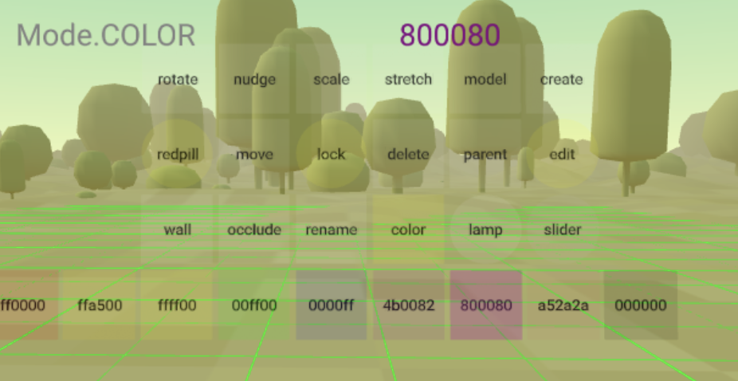

# ARENA AR Builder
An AR/VR capable editing tool to create/manipulate/delete ARENA objects.

## Documentation
The ARENA AR Builder user guide and tutorials: [ARENA Documentation: Authoring Tool](https://arena.conix.io/content/tools/authoring.html).

## Requirements
See top-level python documentation for [Python requirements](https://github.com/conix-center/arena-py). This tool uses the [ARENA Persistence Database](https://github.com/conix-center/arena-persist), so all changes are persisted.

## Quick Start
Usage: `arb` takes at minimum one argument, the first one, a scene name (`hello` in this example).
```bash
python3 tools/arb/arb.py hello
```
(interact with the tool at the website address printed in the console: https://arenaxr.org/[your username]/hello)

## Control Panel

