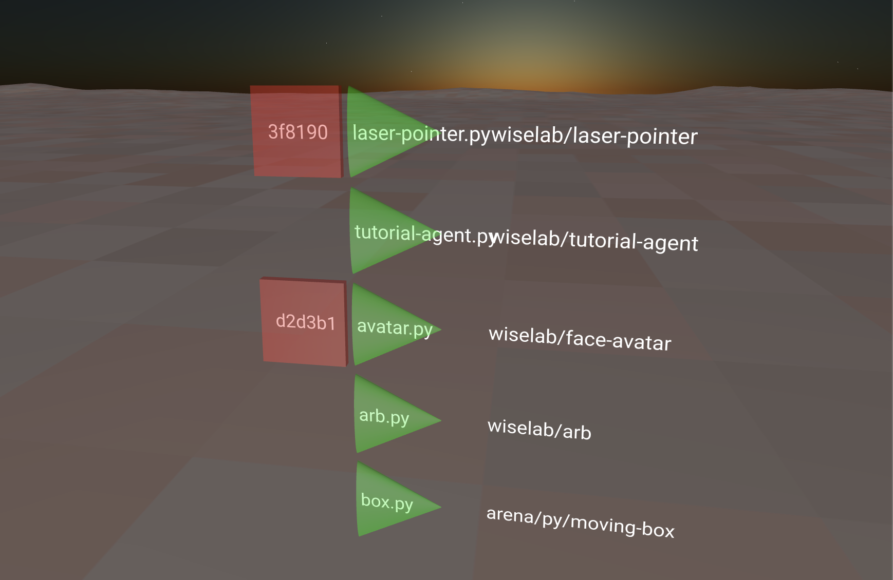

# init3d - program manager

The `init3d` application is designed to be a 3d-interface to launch other programs similar in function to `init.d` in Linux.
Unlike other ARENA applications it doesn't use a default hostname or scene name and expects those variables to be provided via environment variables. 

<!-- how to download it -->
<!-- opening the application -->
# Setup
1. Upload this folder to the ARENA Store (already uploaded at `wiselab/init3d`).
2. Add `init3d.py` as a program on the [Build page](https://arenaxr.org/build) to your scene. Program Data:
    - name: `wiselab/init3d`
    - instantiate: `single`
    - filename: `init3d.py`
    - filetype: `PY`

<!-- picture -->

NOTE: This interface is under construction...

<!-- what are the controls -->
# Operation
- Green triangles are clickable **start** buttons for programs, with program names in text. 
- Red squares are clickable **stop** buttons for programs, with module uuid prefixes in text. 

<!-- space -->
# Functions
- Scans running modules for actively running programs.
- Allows start/stop of listed programs in each scene.
